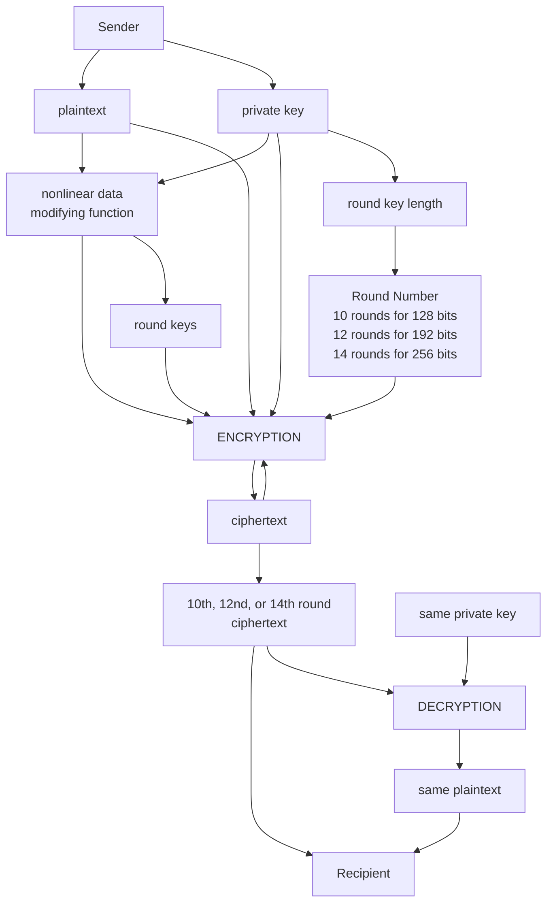

# Encryption:
## A Web App for Advanced Encryption Standard Implementation

Advanced Encryption Standard (AES) is the most secure encryption algorithm nowsaday.

[ENCRYPT 72](https://kietpawpan.github.io/encryption) gets a private key as password/passphrase, e.g., "your private key", to the crypto-js function:

```
CryptoJS.AES.encrypt("Message", "your private key");
```
In this case, CryptoJs derives a 32 byte long encryption key for AES-256 and a 16 byte long initialization vector (iv) from the password, encrypts the "Message" using this key, iv in AES mode CBC and (default) padding Pkcs7 [(Michael Fehr, 2020)](https://stackoverflow.com/a/64802091)


You need a 32 bytes key for AES-256. An Utf-8 encoding of the string c79109c462c34441840551e2ba79830e is one way to create such a 32 bytes sequence. CryptoJS provides the Utf8 encoder for this purpose. Keys generated this way have a reduced value range of 16 instead of 256 values per byte ([Topaco, 2023](https://stackoverflow.com/questions/76066950/why-do-we-use-cryptojs-enc-utf8-parse-in-javascript
)). 


You should never need Utf8.parse for a key. The key should not be a character string, unless it is hex or base 64 encoded ([Maarten Bodewes, 2023](https://stackoverflow.com/questions/76066950/why-do-we-use-cryptojs-enc-utf8-parse-in-javascript
)). 
