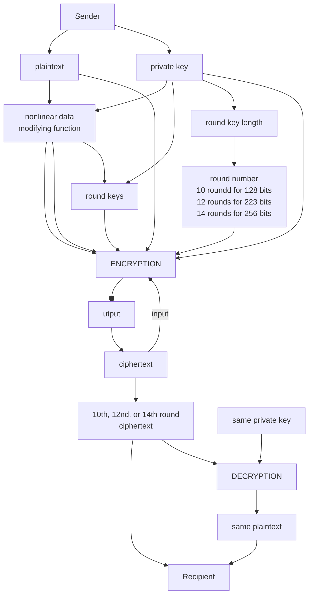

# encryption
## [A Web App for Encrypting and Decrypting Classified Information with AES algorithm](https://kietpawpan.github.io/encryption)

Advanced Encryption Standard (AES) is the most secure encryption algorithm nowsaday.

