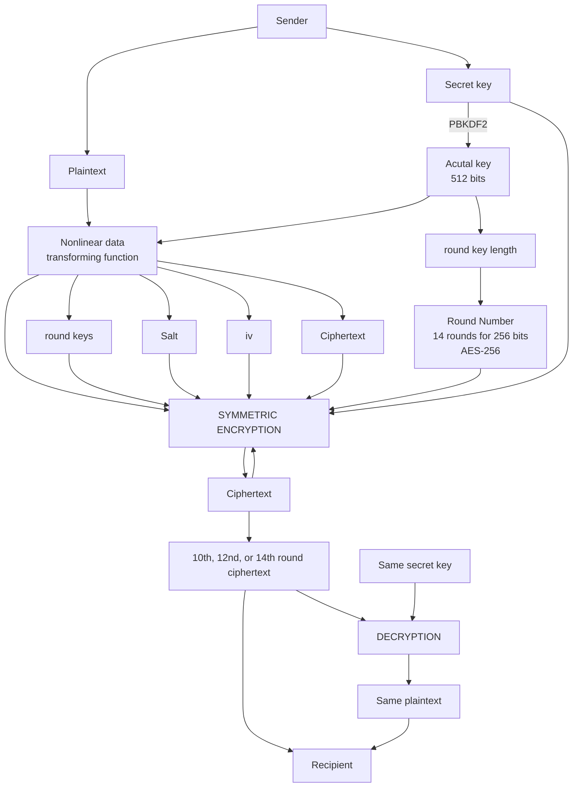

# Encryption:
## A Web App for Advanced Encryption Standard Implementation

[ENCRYPT 72](https://kietpawpan.github.io/encryption) adopts Advanced Encryption Standard (AES), the most secure encryption algorithm in 2024 and probably in decades ahead. AES in ENCRYPT 72 works as follows:

[ENCRYPT 72](https://kietpawpan.github.io/encryption) gets a secret key as password/passphrase to the crypto-js function:

```
CryptoJS.AES.encrypt("Message", "your private key");
```

## AES
According to [CryptoJS (2019)](https://cryptojs.gitbook.io/docs), 

CryptoJS supports AES-128, AES-192, and AES-256. It will pick the variant by the size of the key you pass in. If you use a passphrase, then it will generate a 256-bit key. 
```
var encrypted = CryptoJS.AES.encrypt("Message", "Secret Passphrase");
​var decrypted = CryptoJS.AES.decrypt(encrypted, "Secret Passphrase");
```

### Block Modes and Padding
```
var encrypted = CryptoJS.AES.encrypt("Message", "Secret Passphrase", {
  mode: CryptoJS.mode.CFB,
  padding: CryptoJS.pad.AnsiX923
});
```
CryptoJS supports the following modes:
```
CBC (the default)
CFB
CTR
OFB
ECB
```

And the following padding schemes:
```
Pkcs7 (the default)
Iso97971
AnsiX923
Iso10126
ZeroPadding
NoPadding
```

### The Cipher Input
For ENCRYPT 72
1. The __plaintext__ can be either strings or instances of CryptoJS.lib.WordArray.
2. The __secret key__, must be a string, treated as a passphrase and used to derive an actual key and IV. 


### The Cipher Output
The plaintext you get back after decryption is a WordArray object. The default is an OpenSSL-compatible format.
You can access to all the parameters used during encryption: 
```
var encrypted = CryptoJS.AES.encrypt("Message", "Secret Passphrase");
​
encrypted.key
> "74eb593087a982e2a6f5dded54ecd96d1fd0f3d44a58728cdcd40c55227522223 ";
​
encrypted.iv
> "7781157e2629b094f0e3dd48c4d786115";
​
encrypted.salt
> "7a25f9132ec6a8b34";
​
encrypted.ciphertext
> "73e54154a15d1beeb509d9e12f1e462a0";
​
encrypted
> "U2FsdGVkX1+iX5Ey7GqLND5UFUoV0b7rUJ2eEvHkYqA=";
```

## Key
CryptoJs derives a 32 byte long encryption key for AES-256 and a 16 byte long initialization vector (iv) from the password, encrypts the "Message" using this key, iv in AES mode CBC and (default) padding Pkcs7 [(Michael Fehr, 2020)](https://stackoverflow.com/a/64802091)


You need a 32 bytes key for AES-256. An Utf-8 encoding of the string c79109c462c34441840551e2ba79830e is one way to create such a 32 bytes sequence. CryptoJS provides the Utf8 encoder for this purpose. Keys generated this way have a reduced value range of 16 instead of 256 values per byte ([Topaco, 2023](https://stackoverflow.com/questions/76066950/why-do-we-use-cryptojs-enc-utf8-parse-in-javascript
)). 


You should never need Utf8.parse for a key. The key should not be a character string, unless it is hex or base 64 encoded ([Maarten Bodewes, 2023](https://stackoverflow.com/questions/76066950/why-do-we-use-cryptojs-enc-utf8-parse-in-javascript
)). 
