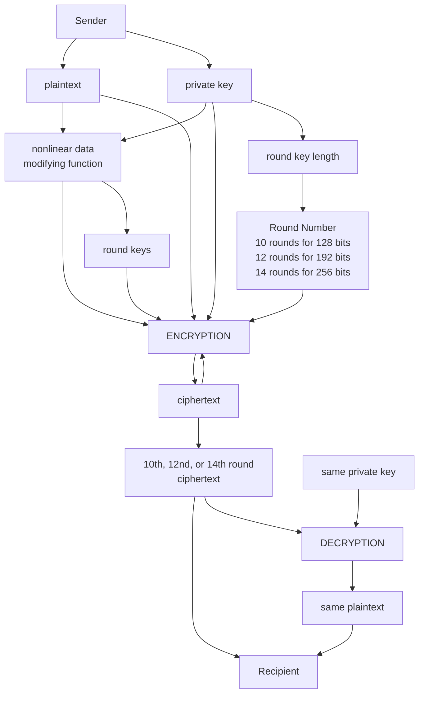

# Encryption:
## [A Web App for Advanced Encryption Standard Implementation](https://kietpawpan.github.io/encryption)

Advanced Encryption Standard (AES) is the most secure encryption algorithm nowsaday.

ENCRYPT 72 get a private key as password/passphrase, e.g., "Password", to the crypto-js function:

```
CryptoJS.AES.encrypt("Message", "Password");
```
Therfore, CryptoJs derives a 32 byte long encryption key for AES-256 and a 16 byte long initialization vector (iv) from the password, encrypts the "Message" using this key, iv in AES mode CBC and (default) padding Pkcs7 [(Michael Fehr, 2020)](https://stackoverflow.com/a/64802091)
