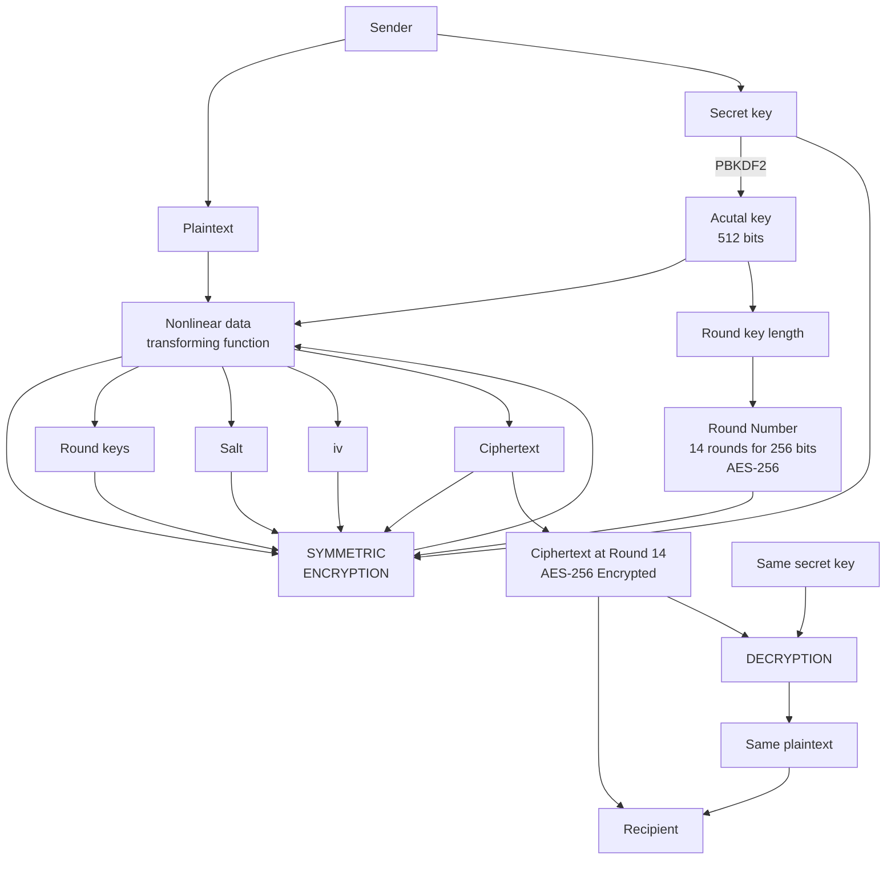

# Encryption:
## A Web App for Advanced Encryption Standard Implementation

[ENCRYPT 72](https://kietpawpan.github.io/encryption) is a web app for implementing Advanced Encryption Standard (AES) with [CryptoJS (2019)](https://cryptojs.gitbook.io/docs) (v  4.0.0). AES is the most secure encryption algorithm in 2024 and probably in decades ahead. AES in ENCRYPT 72 works as follows:

ENCRYPT 72 gets a secret key as password/passphrase to the crypto-js function:

```
CryptoJS.AES.encrypt("Message", "your private key");
```

## AES
ENCRYPT 72 supports AES-256 (TOP SECRET). A secret key will generate a 256-bit key. 
```
var encrypted = CryptoJS.AES.encrypt("Message", "Secret Passphrase");
​var decrypted = CryptoJS.AES.decrypt(encrypted, "Secret Passphrase");
```

### Block Modes and Padding
```
var encrypted = CryptoJS.AES.encrypt("Message", "Secret Passphrase", {
  mode: CryptoJS.mode.CFB,
  padding: CryptoJS.pad.AnsiX923
});
```
ENCRYPT 72 supports __CBC__ mode and use __Pkcs7__ padding scheme.

### The Cipher Input
For ENCRYPT 72
1. The __plaintext__ can be either strings or instances of CryptoJS.lib.WordArray.
2. The __secret key__, must be a string, treated as a passphrase and used to derive an actual key and IV. 


### The Cipher Output
The plaintext you get back after decryption is a WordArray object. The default is an OpenSSL-compatible format.
ENCRYPT 72 allows you access to all the parameters used during encryption, namely actual key, iv, salt, and ciphertext.
```
var encrypted = CryptoJS.AES.encrypt("Message", "Secret Passphrase");
​
encrypted.key
> "74eb593087a982e2a6f5dded54ecd96d1fd0f3d44a58728cdcd40c55227522223 ";
​
encrypted.iv
> "7781157e2629b094f0e3dd48c4d786115";
​
encrypted.salt
> "7a25f9132ec6a8b34";
​
encrypted.ciphertext
> "73e54154a15d1beeb509d9e12f1e462a0";
​
encrypted
> "U2FsdGVkX1+iX5Ey7GqLND5UFUoV0b7rUJ2eEvHkYqA=";
```

