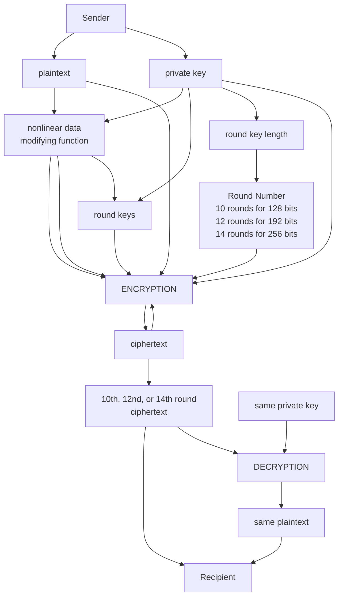

# encryption
## [A Web App for Advanced Encryption Standards Implementation](https://kietpawpan.github.io/encryption)

Advanced Encryption Standard (AES) is the most secure encryption algorithm nowsaday.

